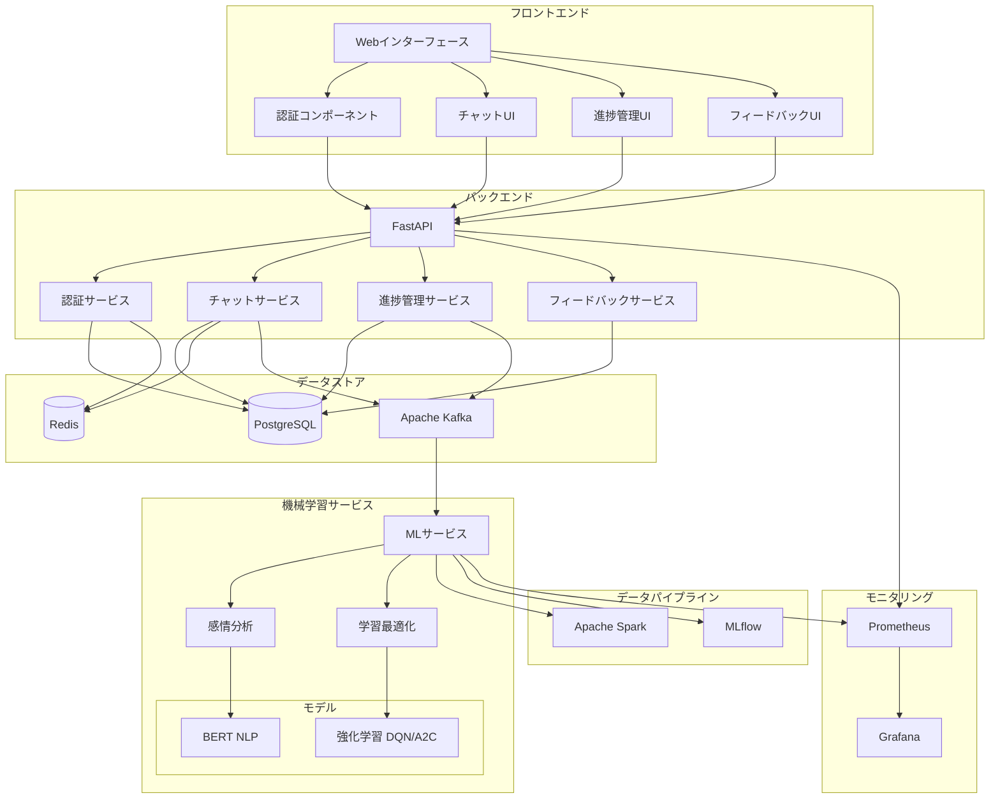
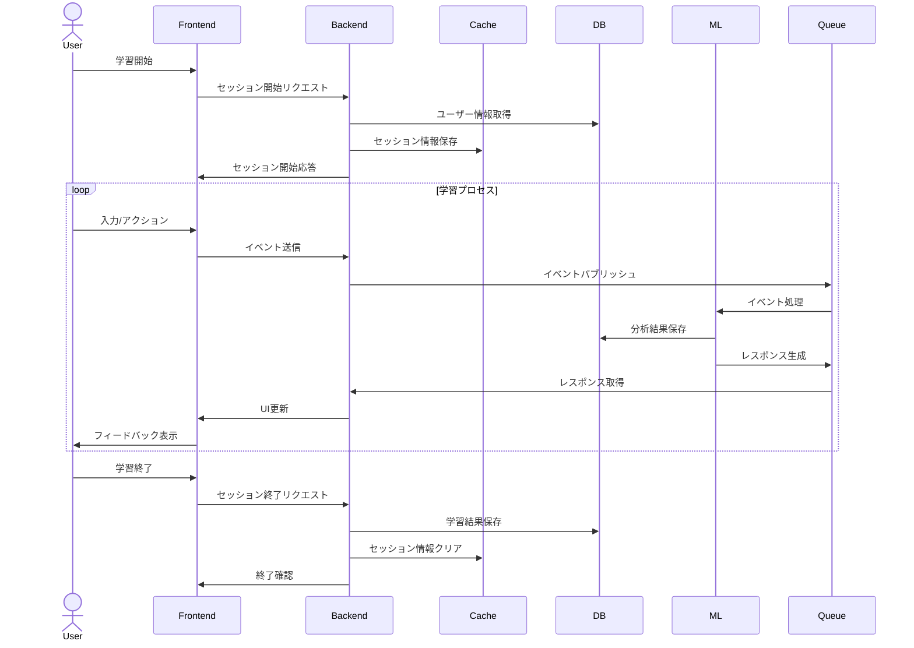

# Non-Cog Learning Platform システムアーキテクチャ

## システム概要図

## データフロー図

## コンポーネント構成

### フロントエンド（Next.js）

- **認証（Auth）**: ユーザー認証・認可管理
- **チャット**: AI キャラクターとのインタラクション
- **進捗管理**: 学習状況の可視化
- **フィードバック**: 学習者へのフィードバック表示

### バックエンド（FastAPI）

- **認証サービス**: JWT 認証、セッション管理
- **チャットサービス**: メッセージ処理、感情分析連携
- **進捗管理サービス**: 学習データ管理、最適化
- **フィードバックサービス**: フィードバック生成

### 機械学習サービス

- **感情分析**: BERT モデルによるテキスト感情分析
- **学習最適化**: DQN/A2C による学習パス最適化
- **MLflow**: モデルのバージョン管理、実験管理

### データストア

- **PostgreSQL**: ユーザーデータ、学習履歴
- **Redis**: セッション管理、キャッシュ
- **Kafka**: イベントストリーム、非同期処理

### データパイプライン

- **Apache Spark**: 大規模データ処理
- **MLflow**: モデル管理、デプロイメント

### モニタリング

- **Prometheus**: メトリクス収集
- **Grafana**: 可視化、アラート

## 主要な処理フロー

1. **ユーザー認証フロー**

   - JWT ベースの認証
   - Redis でのセッション管理

2. **学習セッションフロー**

   - ユーザー入力の受付
   - リアルタイム感情分析
   - 学習パスの動的最適化

3. **フィードバックフロー**

   - 感情分析結果の活用
   - 学習進捗の分析
   - パーソナライズされたフィードバック生成

4. **データ分析フロー**
   - 学習データの収集
   - Spark による分析処理
   - モデルの継続的改善

## スケーラビリティと可用性

- Kubernetes 上での展開
- マイクロサービスアーキテクチャ
- 非同期処理によるスケーラビリティ確保
- キャッシュ層による高速化
