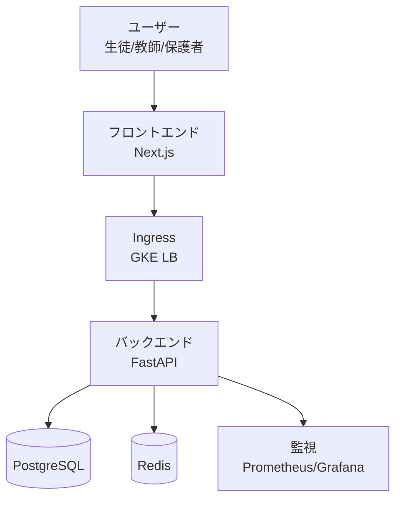
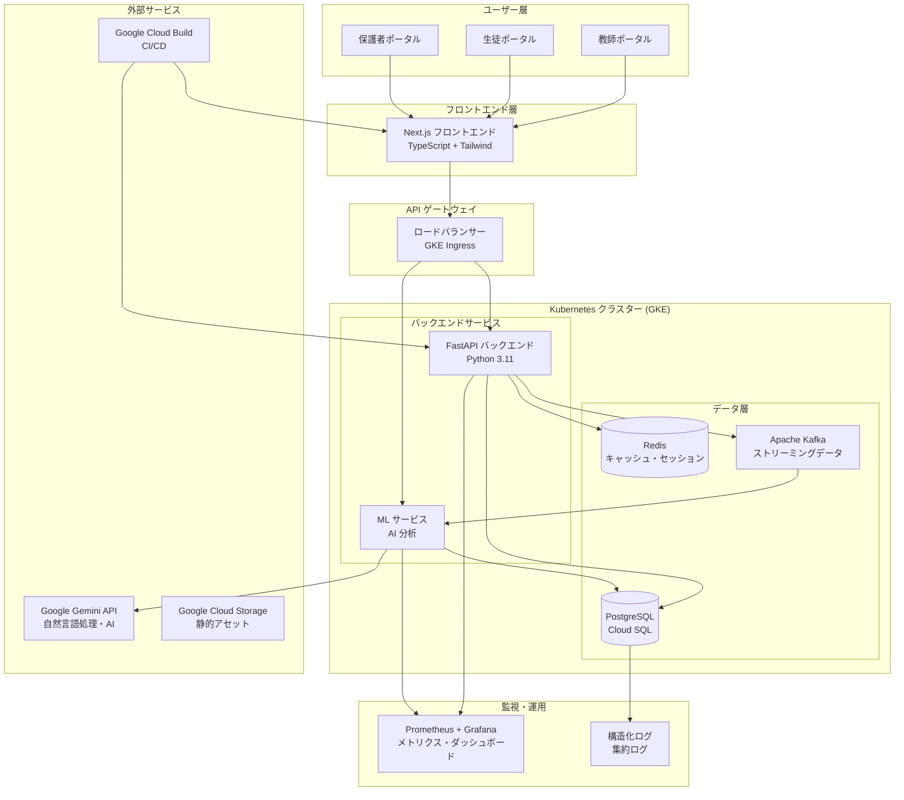
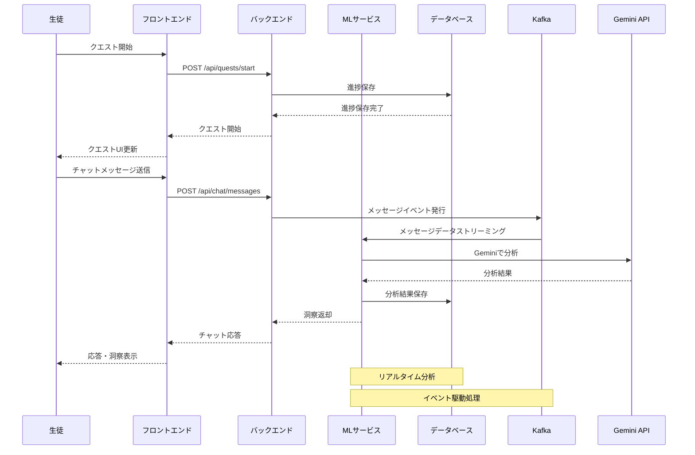
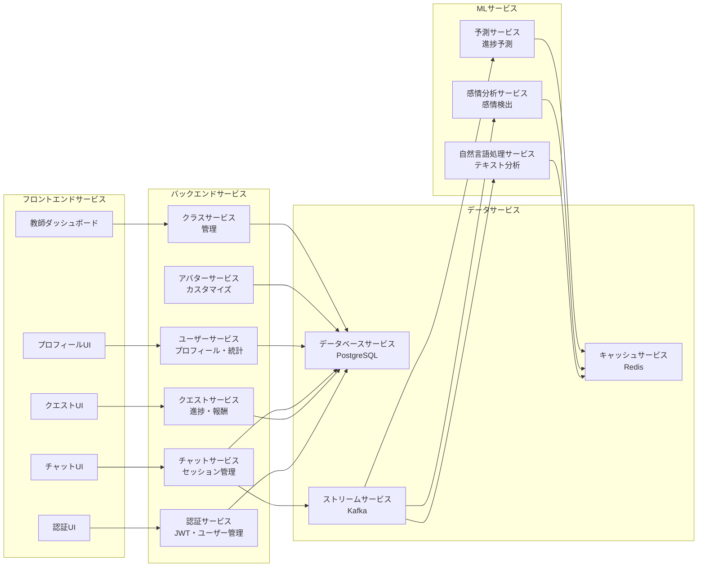
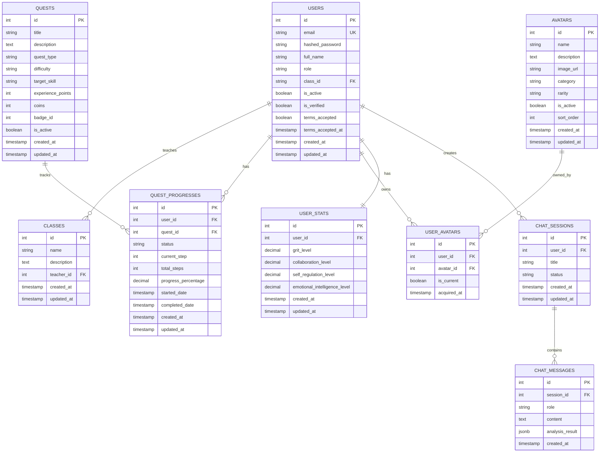
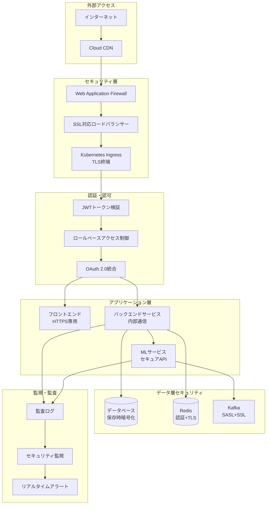
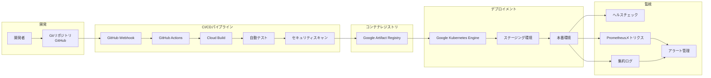
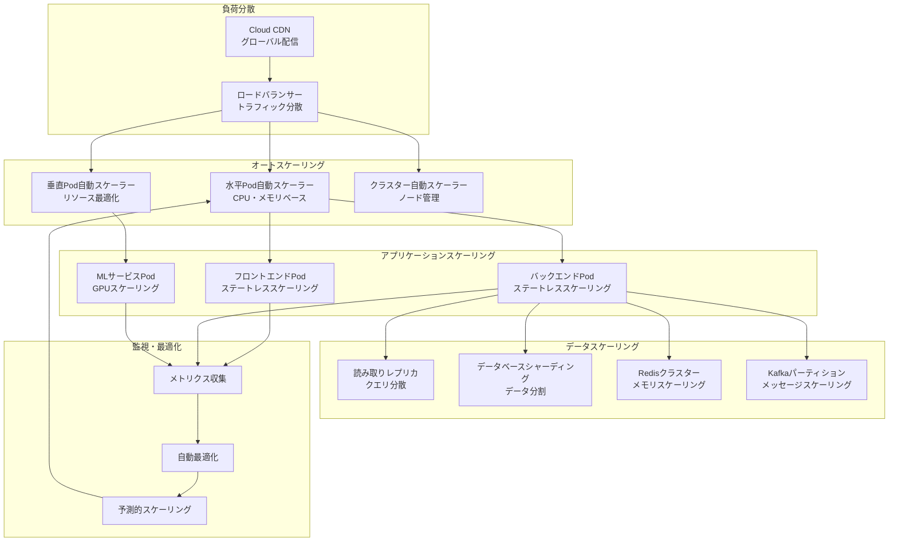
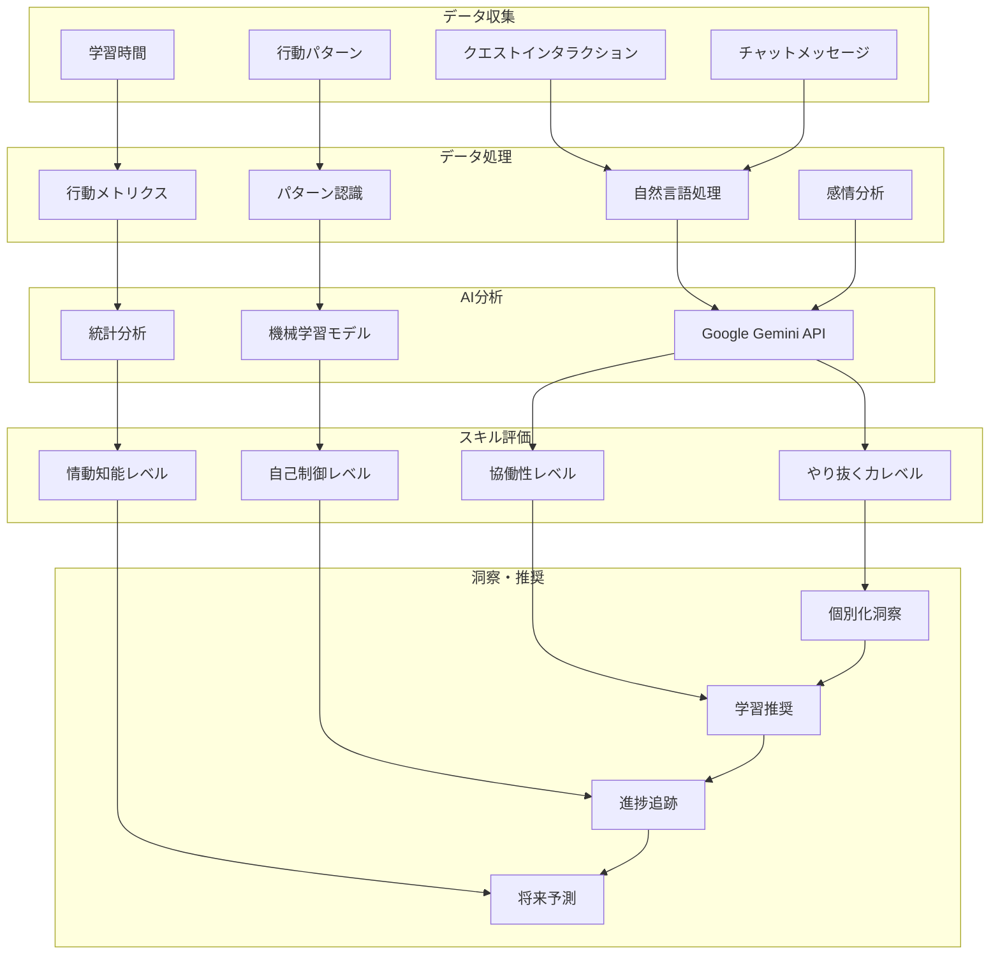
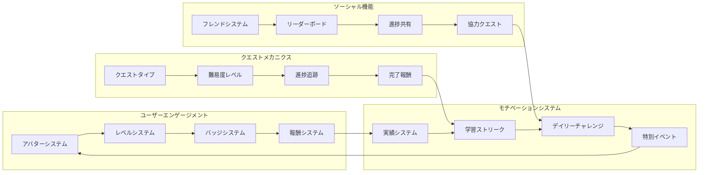

# 7. アーキテクチャ図（Mermaid）

## 7.1 システム全体アーキテクチャ

### 7.1s 簡易アーキテクチャ（発表用）

発表では下記の簡易図で主要要素のみを伝えます（ユーザー → フロント →Ingress→ バックエンド → データ層）。

## 7.2 データフロー図

## 7.3 マイクロサービス構成図

## 7.4 データベース設計図

## 7.5 セキュリティアーキテクチャ図

## 7.6 CI/CD パイプライン図

## 7.7 スケーラビリティ設計図

## 7.8 非認知能力分析フロー図

## 7.9 ゲーミフィケーション要素図

これらの Mermaid 図により、Non-Cog アプリケーションの複雑なアーキテクチャとデータフローを視覚的に理解しやすく表現できます。プレゼンテーションやドキュメントで活用してください。
