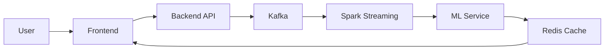
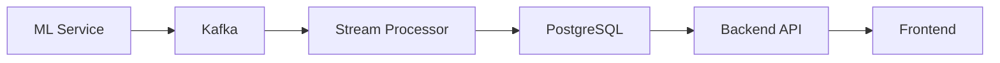

# システムアーキテクチャ解説

## クリーンアーキテクチャ

本プロジェクトでは、クリーンアーキテクチャを採用しています。

```
依存関係の方向 →
[Entities] ← [Use Cases] ← [Interface Adapters] ← [Frameworks]
```

### 1. エンティティ層（`domain/`）

```python
# domain/models/student.py
from dataclasses import dataclass
from datetime import datetime

@dataclass
class Student:
    id: str
    name: str
    created_at: datetime

    def calculate_progress(self) -> float:
        # ビジネスロジック
        pass
```

### 2. ユースケース層（`core/`）

```python
# core/student_service.py
from domain.models import Student
from core.interfaces import StudentRepository

class StudentService:
    def __init__(self, repository: StudentRepository):
        self.repository = repository

    async def get_student_progress(self, student_id: str) -> float:
        student = await self.repository.get_by_id(student_id)
        return student.calculate_progress()
```

### 3. インターフェース層（`api/`）

```python
# api/routes/student.py
from fastapi import APIRouter, Depends
from core.student_service import StudentService

router = APIRouter()

@router.get("/students/{student_id}/progress")
async def get_progress(
    student_id: str,
    service: StudentService = Depends()
) -> float:
    return await service.get_student_progress(student_id)
```

### 4. フレームワーク層（`infrastructure/`）

```python
# infrastructure/repositories/student_repository.py
from core.interfaces import StudentRepository
from domain.models import Student
from sqlalchemy.orm import Session

class SQLAlchemyStudentRepository(StudentRepository):
    def __init__(self, session: Session):
        self.session = session

    async def get_by_id(self, student_id: str) -> Student:
        # データベースアクセス
        pass
```

## イベント駆動アーキテクチャ

学習イベントの処理には、イベント駆動アーキテクチャを採用しています。

### 1. イベントの生成

```python
# api/routes/learning.py
from kafka import KafkaProducer

@router.post("/learning/complete")
async def complete_learning(event: LearningEvent):
    producer.send(
        "learning_events",
        event.json().encode()
    )
```

### 2. イベントの処理

```python
# data_pipeline/consumers/learning_consumer.py
from kafka import KafkaConsumer

async def process_learning_events():
    consumer = KafkaConsumer("learning_events")
    async for message in consumer:
        event = LearningEvent.parse_raw(message.value)
        await process_event(event)
```

## マイクロサービスアーキテクチャ

システムは以下のマイクロサービスで構成されています：

### 1. フロントエンドサービス

```typescript
// frontend/src/pages/learning.tsx
import { useQuery } from "react-query";

export default function LearningPage() {
  const { data } = useQuery("progress", fetchProgress);

  return (
    <div>
      <ProgressChart data={data} />
      <ExerciseList />
    </div>
  );
}
```

### 2. バックエンドサービス

```python
# backend/src/main.py
from fastapi import FastAPI
from api.routes import student, learning

app = FastAPI()
app.include_router(student.router)
app.include_router(learning.router)
```

### 3. ML サービス

```python
# ml/src/main.py
from fastapi import FastAPI
from ml.models import DQNAgent

app = FastAPI()
agent = DQNAgent()

@app.post("/predict")
async def predict(state: State) -> Action:
    return agent.select_action(state)
```

### 4. データパイプライン

```python
# data_pipeline/stream_processor.py
from pyspark.sql import SparkSession

def process_stream():
    spark = SparkSession.builder.getOrCreate()
    stream = spark.readStream \
        .format("kafka") \
        .option("kafka.bootstrap.servers", "kafka:9092") \
        .load()
```

## データフロー

1. ユーザーアクション



2. 学習フィードバック



## セキュリティアーキテクチャ

### 1. 認証

```python
# backend/src/auth.py
from fastapi_security import OAuth2PasswordBearer

oauth2_scheme = OAuth2PasswordBearer(tokenUrl="token")

async def get_current_user(token: str):
    user = await verify_token(token)
    return user
```

### 2. データ保護

```python
# ml/federated/privacy.py
class PrivacyMechanism:
    def apply_differential_privacy(self, data):
        noise = self.generate_noise()
        return data + noise
```

## モニタリングアーキテクチャ

### 1. メトリクス収集

```python
# monitoring/metrics.py
from prometheus_client import Counter, Histogram

REQUEST_COUNT = Counter(
    'http_requests_total',
    'Total HTTP requests'
)

LATENCY = Histogram(
    'request_latency_seconds',
    'Request latency'
)
```

### 2. ログ収集

```python
# monitoring/logging.py
import structlog

logger = structlog.get_logger()
logger.info(
    "request_processed",
    user_id="123",
    latency=0.05
)
```
